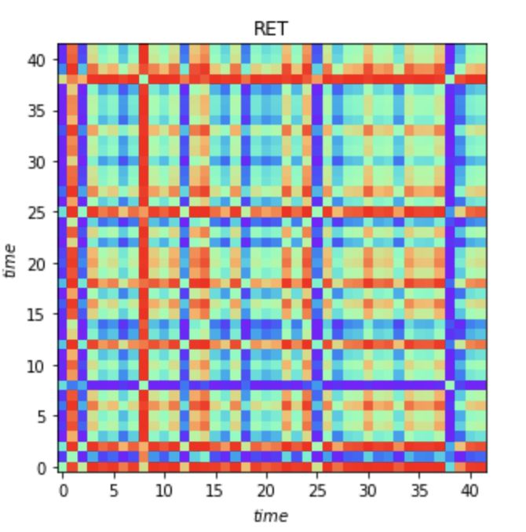
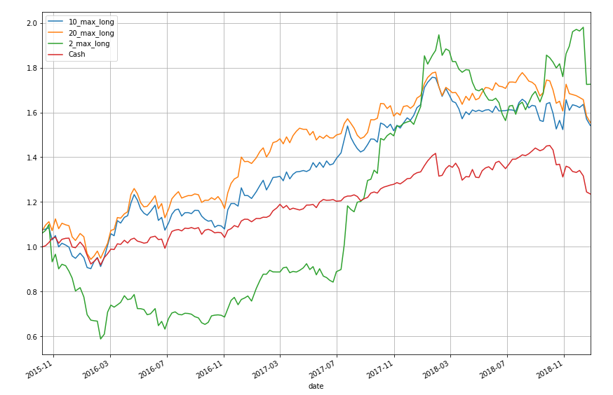
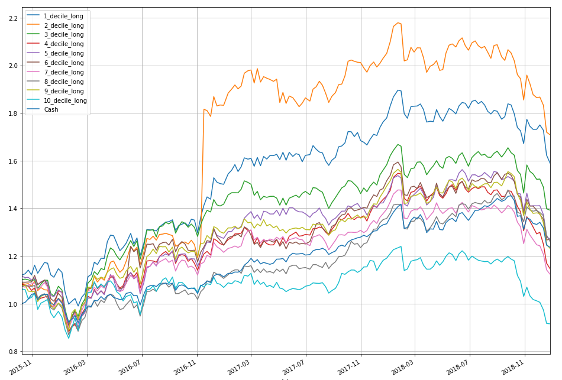
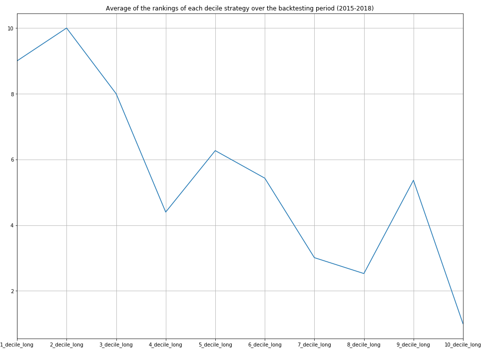

# DeepLearningAllocationCNN

In this project, we aim to implement Convolutional Neural Networks for portfolio selection. In order to fully utilize the advantage of CNN on feature caption and image classification, we converted time series stock data into 2D images first by several different algorithms. Then we used GoogLeNet, AlexNet and ResNet for training, validation and testing. Fi- nally we examined the performance of CNN-based strategy against S&P 500, and the result of GoogLeNet showcases a strong predictive power and feasible future extensions. We also talked about future improvements that could be done on this project.

For more processing details, please refer to Project_Report.pdf

## Image Encoding (1.2 Image Encoding)

GAF and MTF are adopted to convert stock data into images.

### Hyperparameters for Image

The image size indicates the length of data dumped in one image. A large size length may make the image incorporate too much out-of-date information which could have weak predictive power; a small side length may lead to under-fitting. We tried 64, which is roughly a quarter that follows financial statements period, so that one image would be comprised of 64 days of stock information. We also tried 42, which is roughly two months.

Figure 1 is one of five examples (project) in GADF Encoding, images are in 42*42 size. We represented them with color to see differences better but a more realistic representation would be black and white since we just have values between [−1, 1]. This five images form a tensor of size 42x42x, we have 5 input channels here.

## Result (3. Backtesting)

The best result for 3 strategies are listed above, the label ’Cash’ stands for S&P500 that we consider as our benchmark. The Sharpe ratio of ’20max’ is 0.91, ’10max’ is 0.62, ’2max’ is 0.26. As expected the larger the number of stocks considered the smoother is the rolling returns curve. What is quite surprising is that with only 10 or 20 stocks variations are not really high, even similar to SP500 that boasts many more stocks.

A way of checking whether the backtester is producing good results is to consider ”bins” (Figure 3). Instead of considering the N-best stocks at each re-balancing date, we split our stock universe into M subsets of stocks ranked by their prob- ability of going long. Then we expect the first subset to perform really well and the last one to perform bad. Here are the results for GoogLeNet over the period 2015-2018. It is similar to what we expected, small ranked bins perform better. We can see that there is a huge spike in one of the bins. We checked in detail and this is not an error but the stock DRYS took 2000% in one week then returned to normal which causes the spike when going long that stock in one of our strategies.

To analyze this plot with more than the eyes we plotted the average ranking of each of these bins over the time period (Figure 4). What we expect is a positive relationship between the best ranking and the best performing stocks. For example, if the nth bin (decile) has a average rank of n then the strategy delivered by the model is stable and thus more confidence could be secured by its performance in the real market.

## Conclusions (4. Conclusion)

In this project, ResNet, AlexNet and GoogLeNet are applied in the stock selection process. GoogLeNet showcased a better predictive power than the other two models. With the analysis of stock bins performances and average ranking of stock bins, the prediction of GoogLeNet is proved to be somewhat stable rather than lucky guess.

Future improvements could be made by training data with a rolling window, so the model could be exposed to data more timely and capture the regime better. This may require expensive computation resources but could deliver a better result. Another improvement we came up with is that more meaning features could be used in this project. So far we only used very simple and easy features, which may also limit the information the model could learn from.
